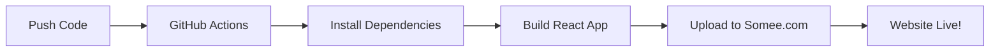

# 🚀 BẮT ĐẦU TỪ ĐÂY!

Chào mừng bạn đến với hệ thống deploy tự động React App lên Somee.com!

## 📖 Bạn Nên Đọc Gì?

### 🏃‍♂️ Nếu Bạn Muốn Bắt Đầu Nhanh (10 phút)

👉 **Đọc file**: [QUICK_START.md](QUICK_START.md)

Hướng dẫn ngắn gọn, đi thẳng vào vấn đề, chỉ các bước cần thiết.

---

### 📚 Nếu Bạn Muốn Hiểu Rõ Từng Bước (20 phút)

👉 **Đọc file**: [HUONG_DAN_DEPLOY.md](HUONG_DAN_DEPLOY.md) ⭐ **KHUYÊN DÙNG**

Hướng dẫn chi tiết bằng tiếng Việt, giải thích từng bước, có xử lý lỗi và FAQ.

---

### ✅ Nếu Bạn Muốn Checklist Để Theo Dõi

👉 **Đọc file**: [DEPLOYMENT_CHECKLIST.md](DEPLOYMENT_CHECKLIST.md)

Checklist đầy đủ để đảm bảo không bỏ sót bước nào.

---

### 🌍 Nếu Bạn Muốn Đọc Tiếng Anh

👉 **Đọc file**: [DEPLOYMENT_GUIDE.md](DEPLOYMENT_GUIDE.md)

Hướng dẫn chi tiết bằng tiếng Anh.

---

## 🎯 Quy Trình Deploy Tổng Quan

```
1. Chuẩn bị Somee.com
   ↓
2. Cấu hình GitHub Secrets
   ↓
3. Push code lên GitHub
   ↓
4. GitHub Actions tự động:
   - Build React app
   - Deploy lên Somee.com
   ↓
5. Website live! 🎉
```

---

## 📁 Cấu Trúc Files Đã Được Tạo

```
test/
├── .github/
│   └── workflows/
│       ├── deploy.yml          ← GitHub Actions workflow
│       └── README.md           ← Giải thích workflow
│
├── public/
│   ├── web.config              ← Cấu hình IIS cho Somee.com
│   └── ... (các files khác)
│
├── src/
│   └── ... (React app của bạn)
│
├── BAT_DAU_O_DAY.md           ← File này (bạn đang đọc)
├── QUICK_START.md             ← Hướng dẫn nhanh
├── HUONG_DAN_DEPLOY.md        ← Hướng dẫn chi tiết (Tiếng Việt) ⭐
├── DEPLOYMENT_GUIDE.md        ← Hướng dẫn chi tiết (Tiếng Anh)
├── DEPLOYMENT_CHECKLIST.md    ← Checklist theo dõi
├── README.md                  ← README chính của project
└── package.json               ← Dependencies
```

---

## 🔑 Những Gì Bạn Cần Chuẩn Bị

### 1. Tài Khoản

- ✅ GitHub account (miễn phí)
- ✅ Somee.com account (miễn phí)

### 2. Thông Tin FTP Từ Somee.com

- ✅ FTP Server (ví dụ: `ftp.yourdomain.somee.com`)
- ✅ FTP Username
- ✅ FTP Password

### 3. Tools Trên Máy

- ✅ Git
- ✅ Node.js
- ✅ Code editor (VS Code, etc.)

---

## ⚡ Bắt Đầu Ngay!

### Bước 1: Chọn Hướng Dẫn

Chọn một trong các file hướng dẫn ở trên (khuyên dùng [HUONG_DAN_DEPLOY.md](HUONG_DAN_DEPLOY.md))

### Bước 2: Làm Theo Từng Bước

Đọc và làm theo từng bước trong hướng dẫn

### Bước 3: Deploy!

Push code lên GitHub và xem magic xảy ra! ✨

---

## 🆘 Cần Giúp Đỡ?

### Gặp Lỗi?

👉 Xem phần **"Xử Lý Lỗi Thường Gặp"** trong [HUONG_DAN_DEPLOY.md](HUONG_DAN_DEPLOY.md)

### Có Câu Hỏi?

👉 Xem phần **"Câu Hỏi Thường Gặp"** trong [HUONG_DAN_DEPLOY.md](HUONG_DAN_DEPLOY.md)

### Vẫn Không Giải Quyết Được?

- Kiểm tra GitHub Actions logs
- Kiểm tra browser console (F12)
- Test FTP connection bằng FileZilla

---

## 📊 Workflow Hoạt Động Như Thế Nào?



**Tự động 100%!** Bạn chỉ cần push code, phần còn lại GitHub Actions lo! 🤖

---

## 🎯 Sau Khi Deploy Thành Công

### Mỗi Lần Cập Nhật Code:

```bash
git add .
git commit -m "Update feature X"
git push
```

→ Website tự động deploy! 🚀

### Không Cần:

- ❌ Build thủ công
- ❌ Upload FTP thủ công
- ❌ SSH vào server
- ❌ Chạy lệnh trên server

### Chỉ Cần:

- ✅ `git push`
- ✅ Đợi 3-5 phút
- ✅ Website updated!

---

## 💡 Tips & Tricks

### Tip 1: Xem Deployment Status

Thêm badge vào README.md:

```markdown

```

### Tip 2: Deploy Thủ Công

Vào GitHub Actions → Run workflow → Chọn branch → Run

### Tip 3: Test Build Local

```bash
npm run build
npx serve -s build
```

### Tip 4: Xem Logs

GitHub Actions → Click workflow run → Xem từng step

---

## 🎊 Chúc Mừng!

Bạn đã có một hệ thống CI/CD hoàn chỉnh cho React app!

**Bây giờ hãy bắt đầu với [HUONG_DAN_DEPLOY.md](HUONG_DAN_DEPLOY.md)!** 👈

---

## 📞 Resources

- **Somee.com**: https://somee.com
- **GitHub Actions**: https://github.com/features/actions
- **React Docs**: https://react.dev
- **FTP Deploy Action**: https://github.com/SamKirkland/FTP-Deploy-Action

---

**Happy Coding! 💻✨**

_Được tạo với ❤️ để giúp bạn deploy dễ dàng hơn_
